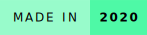
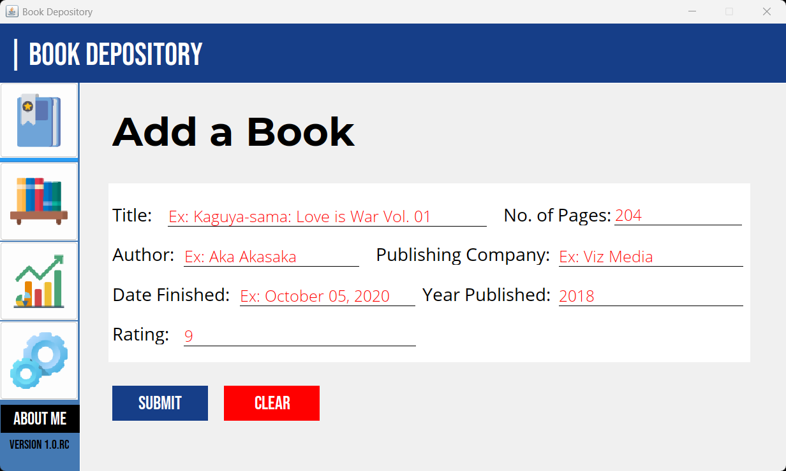
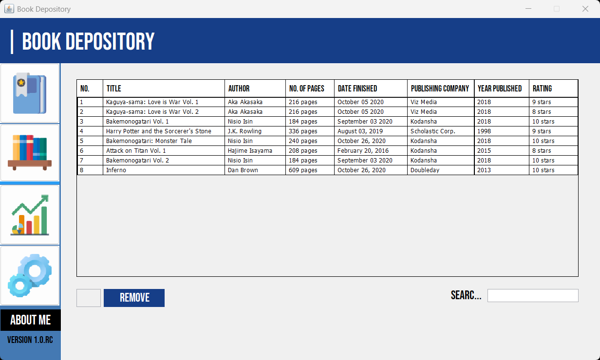
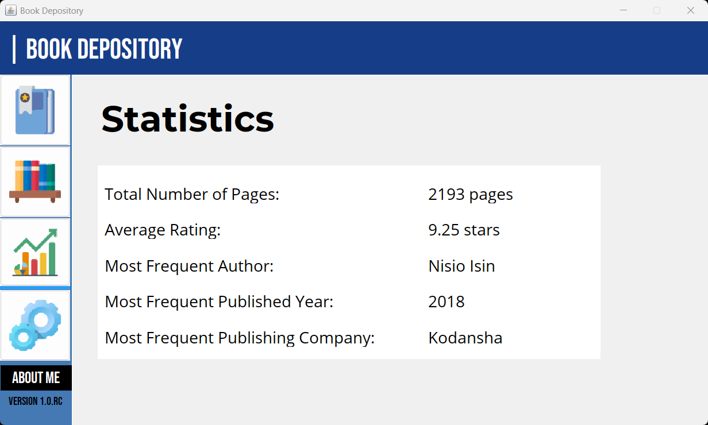
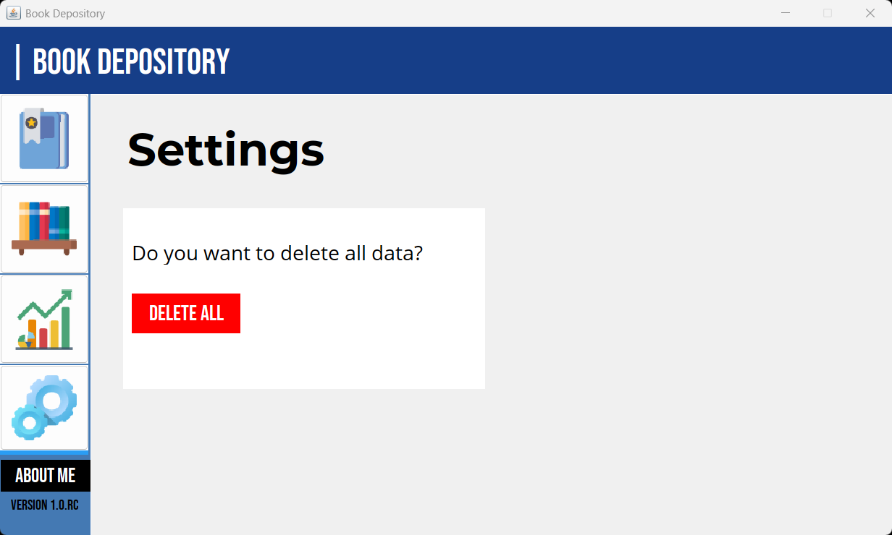
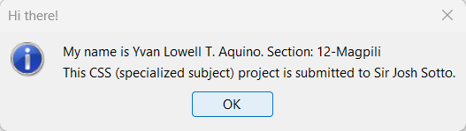

# Book Depository
  

A depository for books you've read, with a couple of features to separate it from the rest.

### Author's Notes

I wrote that description above in 2020. Right now, there's not really any features in this program that separate it from the rest. It's a standard book tracking application, meant to be a successor of [e-library](https://github.com/Lowell0803/e-library).

But, I'm still proud of this one (as I am with my other projects). This was my second Java project and I think I improved a lot in terms of my design skills. 

This project was for the subject **Computer Systems Servicing** in grade 12. This was counted as a monthly examination and periodical examination.

## Screenshots

    <h3>Add Tab</h3>
    
    <h3>Books Tab</h3>
    
    <h3>Stats Tab</h3>
    
    <h3>Settings Tab</h3>
    
    <h3>About Me Panel</h3>
    

## How to Run

As of time of writing (2025), you can download the latest JDK of Java (JDK 24).

Then, in the terminal, type the ff. commands: `javac BookDepository.java` and then `java BookDepository`.

## Feedback

If you have any feedback/comment/request, please reach out to [aquino.ylt@gmail.com](mailto:aquino.ylt@gmail.com).

### Thank you and God bless!